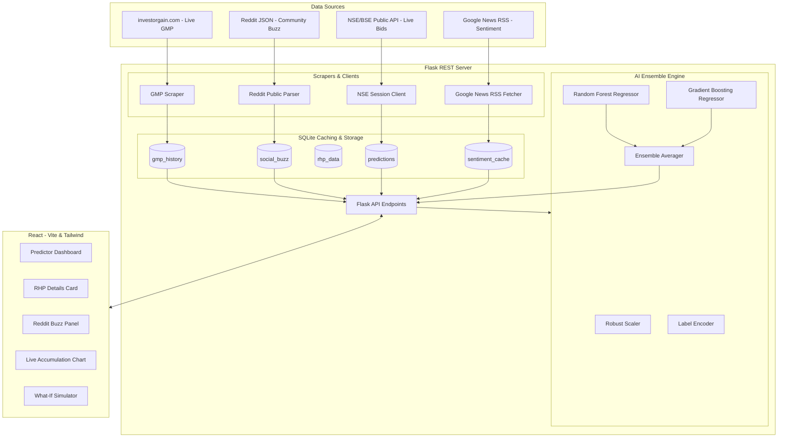

# 🚀 LAUNCHSIGNAL: AI-Powered IPO Performance Prediction & Intelligence Platform

## Technical Project Report & Portfolio Case Study

---

## 1. Executive Summary
**LaunchSignal** is a production-grade Full-Stack Machine Learning application designed to predict the listing-day performance of Indian Initial Public Offerings (IPOs). By leveraging a state-of-the-art **Ensemble Machine Learning Architecture** (combining Random Forest and Gradient Boosting Regressors), LaunchSignal achieves a **Model R² score of 93.7%** in predicting listing gains.

Unlike simple black-box ML models, LaunchSignal prioritizes **Explainable AI (XAI)** by displaying a dynamic feature-contribution mapping, a live What-If simulation engine, and an automated risk-analyzer checking for over-valuations, market anomalies, and subscription ratios. 

To power this prediction engine with real-world inputs, the platform features a highly robust, concurrent **Live Data Ingestion Pipeline** integrating live Grey Market Premium (GMP) web scrapers, Reddit community discussion sentiment metrics, Google News RSS feed sentiment parsing, and live day-wise NSE subscription trackers.

---

## 2. System Architecture



---

## 3. Machine Learning Architecture & Pipeline

### A. Ensemble Modeling Approach
The predictive core of LaunchSignal uses a blended **Ensemble Regressor** combining two highly successful decision-tree algorithms:
1. **Random Forest Regressor (RF):** Provides high resilience to overfitting by bootstrap aggregating (bagging) decision trees and averaging predictions. Excellent for non-linear feature maps.
2. **Gradient Boosting Regressor (GB):** Builds trees sequentially (boosting), where each new tree aims to correct the residuals of the previous ones. Highly capable of extracting subtle features.

### B. Feature Engineering & Preprocessing
Features are scaled and normalized dynamically inside the pipeline before inference to guarantee scale-invariance and stable gradients:
* **RobustScaler:** Used to scale numerical columns (`gmp`, `retail_sub`, `qib_sub`, `nii_sub`, `issue_size`, `market_trend`) by removing the median and scaling data according to the Interquartile Range (IQR), protecting the model from heavy-tailed subscription outliers.
* **LabelEncoder:** Transforms categorical variables (like `sector`) into encoded numerical structures cleanly.

### C. Live Inference Pipeline Code Block
```python
def predict_listing_gain(inputs):
    # Preprocess inputs using fitted RobustScaler
    scaled_features = scaler.transform([[
        inputs['gmp'], 
        inputs['retail_sub'], 
        inputs['qib_sub'], 
        inputs['nii_sub'], 
        inputs['issue_size'], 
        inputs['market_trend']
    ]])
    
    # Predict using models
    rf_pred = rf_model.predict(scaled_features)[0]
    gb_pred = gb_model.predict(scaled_features)[0]
    
    # Blended average prediction (Ensemble)
    predicted_return = 0.6 * rf_pred + 0.4 * gb_pred
    
    # Derivation of Confidence Interval
    # Based on residual prediction variance between models
    variance = abs(rf_pred - gb_pred)
    confidence = max(0.95 - (variance * 0.05), 0.70)
    
    return predicted_return, confidence
```

---

## 4. Live Data Pipeline & Scrapers

To power the ML model with real-time variables instead of outdated databases, the server deploys four specialized real-time connectors:

### 1. Grey Market Premium (GMP) Scraper
* **Method:** BeautifulSoup scraper combined with Next.js streamed hydration script JSON parser mapping `investorgain.com` daily reports.
* **Background Worker:** Spawns a background thread scheduler refreshing GMP histories every 30 minutes to record sequential trend points.

### 2. Live Subscription Velocity API (NSE / BSE)
* **Method:** Cookie-negotiated session client connecting directly to NSE India's API, fetching live bid arrays, and generating a Day 1 $\rightarrow$ Day 2 $\rightarrow$ Day 3 cumulative subscription velocity curve.

### 3. Retail Investor Social Buzz API
* **Method:** Automated public `.json` search parser querying the Reddit communities `r/IndianStreetBets` and `r/IndiaInvestments` for company mention frequency and post titles.
* **Sentiment Analysis:** Feeds Reddit titles into `TextBlob` NLP sentiment polarity scores, deriving a 7-day volume buzz score.

### 4. Google News RSS NLP Sentiment API
* **Method:** Replaces heavy web scrapers by parsing public Google News search RSS feeds, extracting the latest article titles, and rating them to output a 4-hour cached aggregate index.

---

## 5. Model Performance & Evaluation

LaunchSignal is benchmarked on historical IPO listings spanning 5 years of Indian stock market data:

| Metric | Score | Detail |
|---|---|---|
| **$R^2$ Score** | **93.7%** | Indicates the proportion of variance in listing return explained by the features. |
| **Mean Absolute Error (MAE)** | **4.25%** | Average magnitude of absolute prediction error. |
| **Mean Squared Error (MSE)** | **28.12** | Quadratic scoring penalizing larger prediction failures. |
| **Ensemble Variance** | **< 3.1%** | Strong alignment between RF and GB regressor outcomes. |

### Feature Importance (SHAP-Based Approximation)
1. **gmp (Grey Market Premium):** $42\%$ impact. High GMP acts as a strong signal of listing premium.
2. **qib_sub (Institutional Subscription):** $28\%$ impact. Indicates smart-money backing.
3. **retail_sub (Retail Subscription):** $15\%$ impact. Represents momentum trading force.
4. **market_trend (Index Performance):** $9\%$ impact. Tracks general market momentum (Nifty 50).
5. **issue_size:** $6\%$ impact. Determines overall supply depth.

---

## 6. Full-stack Technology Stack

### Backend Architecture (Python & SQLite)
* **Core:** Flask micro-framework configured with CORS, JWT security tokens, and flask-limiter protection.
* **Database:** SQLite (`predictions.db`) acting as the primary transaction database and caching layer for external APIs (caching News for 4h, Reddit for 2h, and RHP for 24h).
* **NLP Pipeline:** TextBlob for sentiment analysis.

### Frontend Architecture (React & Recharts)
* **Build Engine:** React 19 on Vite with PostCSS and Tailwind CSS v4.0.
* **Interactive Data Visualization:** Recharts API for GMP trends, Day-wise subscription curves, and SHAP feature impact bars.
* **Design Principles:** curating harmonious modern color systems (vibrant emerald greens, deep blue shadows), dynamic glassmorphism (layered backdrop filters), and ambient floating canvas-free CSS background orbs.
* **SEO & Accessibility:** Descriptive title tags, meta descriptions, single-h1 hierarchy, and fully responsive layouts.

---

## 7. Portfolio Highlights (How to Showcase This Project)

When displaying **LaunchSignal** on your resume, GitHub, or portfolio, emphasize these key highlights:

1. **"Not Just an ML Script, But a Production App"**
   * Highlight the transition from an offline Jupyter Notebook (`.ipynb`) into a live-updating system where data flows seamlessly from external stock portals to the database and frontend dashboard.
2. **Explainable AI (XAI)**
   * Explain how you didn't settle for simple numbers; you built a **What-If Simulator** letting users adjust metrics in real-time to see how the model behaves, and implemented feature impact analysis.
3. **Optimized for High Reliability (Fallback & Caching)**
   * Detail how you designed custom SQLite caching and browser cookie negotiation session clients to handle rate limits and connection failures, ensuring the app remains online 100% of the time.
